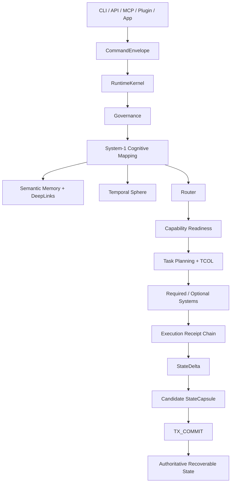
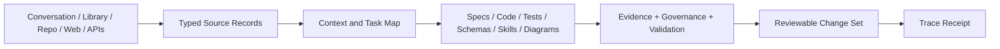

# FRED OS vNext

FRED OS is the deployable runtime and repository environment for the FRED/System-OS research program. The vNext implementation provides explicit, inspectable infrastructure around model inference: configuration, governance, cognitive routing, temporal state, semantic evidence, capability readiness, transactional execution, repository refinement, observability, and recovery.

It does **not** treat architectural declarations as proof of execution. Systems, protocols, skills, PseuLang/QeuLang definitions, and candidate implementations retain explicit maturity and evidence boundaries until executable tests support stronger claims.

## Current tested runtime spine

The consolidated vNext line currently includes:

- deterministic `RuntimeKernel` boot from frozen TOML configuration;
- boot-time invariant checks and configuration hashing;
- governance pre-scan and explicit S8 kernel-governance handling;
- dependency-resolved S1–S13 adapter registry with maturity/readiness accounting;
- System-1 cognitive mapping and situation/temporal signals;
- Temporal Sphere state with working/contextual/episodic structures and restart hydration;
- Semantic Memory Lake over versioned artifacts, immutable DeepLinks, authority/lifecycle labels, and SQLite audit storage;
- config-led routing with required, hard-gate, and optional capabilities;
- Task Analysis / Task-Competency orchestration with fail-closed capability authorization;
- transactional `CommandEnvelope → Receipt chain → StateDelta → StateCapsule → TX_COMMIT` execution;
- hash-chained Write-Ahead Log and recovery that ignores uncommitted candidate capsules;
- deterministic logical replay tests across clean genesis runtimes;
- evidence-governed retrieval-to-repository refinement with source closure and validation receipts;
- structured observability events carrying runtime and configuration evidence.

## Runtime authority model



The governing recovery rule is simple: **a persisted capsule is authoritative only when the Write-Ahead Log contains the corresponding commit marker.** An interrupted transaction may leave forensic artifacts, but reboot restores the latest committed logical state.

## Evidence and repository refinement

Retrieved conversation, library, repository, web, API, and tool data can be normalized into typed `SourceRecord` objects and transformed into candidate repository artifacts through the governed refinement pipeline.



Evidence states distinguish `DECLARED`, `STRUCTURALLY_SPECIFIED`, `MODEL_INTERPRETED`, `EMPIRICALLY_OBSERVED`, `TOOL_SUPPORTED`, `RUNTIME_ENFORCED`, and `COUNTERFACTUALLY_VALIDATED`. Strong labels require corresponding evidence; polished prose is not itself runtime proof.

## Key entry points

- `src/fred_os/runtime/` — transactional kernel, contracts, state, WAL, routing, capability and task orchestration
- `src/fred_os/temporal/` — Temporal Sphere implementation
- `src/fred_os/systems/` — System adapters and System-1 implementation
- `src/fred_os/semantic_memory.py` / `src/fred_os/artifact_store.py` — semantic evidence, immutable DeepLinks, durable audit storage
- `src/systemos/repository_pipeline/` — retrieval-to-repository refinement contracts and pipeline
- `tests/test_m0_runtime_transaction_recovery.py` — canonical M0 atomic recovery/replay gate
- `tests/test_vnext_runtime.py` — routing, capability maturity, task-competency and fail-closed behavior
- `tests/unit/test_repository_pipeline.py` — repository-refinement validation
- `specs/protocols/task_competency_orchestration.md` — TCOL runtime contract
- `docs/architecture/retrieval-to-repository-pipeline.md` — repository-refinement architecture
- `skills/repository-refinement/SKILL.md` — refinement workflow
- `specs/functionings/repository_refinement.pseulang.md` — PseuLang abstraction

## Run the tests

```bash
python -m pip install -e '.[dev]'
python -m pytest -q
```

## Development policy

The goal of vNext is to keep one coherent, test-backed integration line. New work should branch briefly from the canonical line, carry focused acceptance tests, and be merged back after validation rather than becoming a permanent parallel architecture. Candidate systems remain explicitly marked as candidates until their implementation and acceptance evidence are present.
