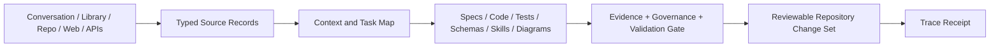

# Fred-OS

Fred-OS is the deployable repository and runtime environment for the FRED/System-OS research program. It is intended to provide governed structure around model inference: task interpretation, context assembly, cognitive routing, tools, artifact production, evaluation, observability, and project continuity.

## Current repository state

This repository contains early System prototypes and an emerging vNext architecture. The first vNext executable slice formalizes how retrieved conversation, library, repository, web, API, and tool data becomes reviewable repository artifacts.



## vNext entry points

- [Retrieval-to-Repository Architecture](docs/architecture/retrieval-to-repository-pipeline.md)
- [Repository Refinement Skill](skills/repository-refinement/SKILL.md)
- [PseuLang Functioning](specs/functionings/repository_refinement.pseulang.md)
- [Python Contracts](src/systemos/repository_pipeline/)
- [Unit Tests](tests/unit/test_repository_pipeline.py)

## Design commitments

- Provider-agnostic core runtime and typed capability adapters.
- Source closure and provenance retained from retrieval through repository output.
- Explicit evidence states: declared, specified, interpreted, observed, tool-supported, runtime-enforced, and counterfactually validated.
- PseuLang and QeuLang remain declarative until executable tooling proves otherwise.
- Systems are selected functions and perspectives; orchestration chooses the smallest sufficient ensemble.
- Repository writes, tests, persistence, and external actions require tool receipts.
- Credentials and environment-specific secrets never belong in source control.

## Run the current tests

The vNext pipeline uses only the Python standard library; the tests require `pytest`.

```bash
PYTHONPATH=src python -m pytest tests/unit/test_repository_pipeline.py
```

## Repository direction

The target architecture separates documentation, schemas, specifications, implementation, tests, examples, skills, tools, and deployment assets so human developers and model agents can load only the context needed for the current task.
