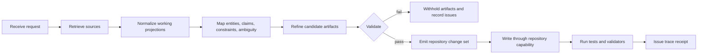
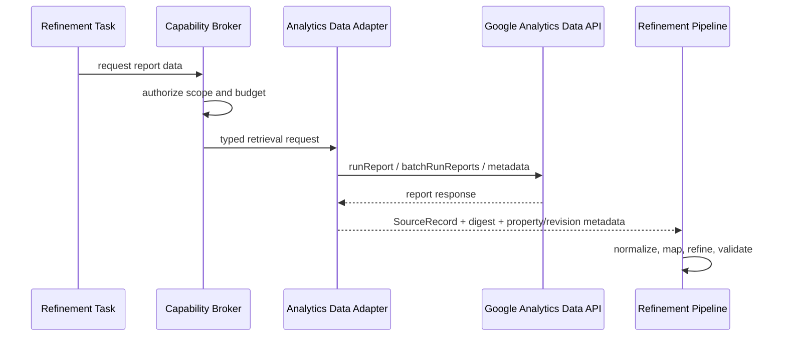

# Retrieval-to-Repository Refinement Pipeline

**Status:** Initial executable contract  
**Scope:** Receive, retrieve, normalize, refine, validate, and emit repository artifacts without losing provenance or overstating implementation state.

## Why this exists

Fred-OS needs a formal boundary between *finding information* and *changing a repository*. Retrieval produces evidence-bearing source records. Refinement turns those records into candidate code, specifications, tests, diagrams, schemas, and skills. Repository writes happen only after path safety, source closure, evidence-state, purpose, and governance checks pass.

The control plane remains provider-agnostic. A semantic adapter may use a hosted model, local model, deterministic rules, or human review, but it must satisfy the same typed contracts.

## Lifecycle

## Source record contract

Every retrieved item becomes an immutable `SourceRecord` with:

- stable `source_id`;
- source kind and URI;
- revision and fragment when available;
- retrieval timestamp;
- SHA-256 digest of the retrieved content;
- evidence state;
- metadata needed to reproduce or audit the retrieval.

Normalization creates a working projection. It does **not** replace the original digest or pretend transformed content is the source.

## Evidence states

| State | Meaning |
|---|---|
| `DECLARED` | Stated by a person or artifact, not independently checked. |
| `STRUCTURALLY_SPECIFIED` | Encoded in a schema, skill, contract, or design. |
| `MODEL_INTERPRETED` | Produced by semantic interpretation. |
| `EMPIRICALLY_OBSERVED` | Observed in data or behavior. |
| `TOOL_SUPPORTED` | Confirmed by a tool result. |
| `RUNTIME_ENFORCED` | Enforced by executable validation with a receipt. |
| `COUNTERFACTUALLY_VALIDATED` | Causal dependence tested by controlled counterfactual variation. |

A polished specification is not automatically runtime-enforced. The pipeline rejects `RUNTIME_ENFORCED` and `COUNTERFACTUALLY_VALIDATED` labels unless their corresponding receipts are attached.

## System-OS functional allocation

The Systems are selected perspectives and functions, not fictional always-running modules.

| Function | Primary contribution |
|---|---|
| S1 Cognitive Mapping | entities, claims, dependencies, constraints, task graph |
| S2 Concept Association | cross-source bridges and reusable abstractions; analogy remains distinct from evidence |
| S3 NLP/NLU/NLG | intent parsing, document normalization, artifact language |
| S4 Quantum-Inspired Semantics | preserve competing interpretations and delay premature collapse |
| S5 Emotional-Ethical Appraisal | dignity, vulnerability, tone, care constraints |
| S6 Influence Mapping | provenance graph, causal links, source-to-artifact influence |
| S7 Metacognition | retrieval-quality critique, assumption checks, strategy revision |
| S8 Governance | permissions, privacy, claims, tool authorization, write boundary |
| S9 Purpose Alignment | rank permitted changes by the user’s stated goal |
| S10 Artistic Intelligence | diagrams, information design, representation refinement |
| S11 Evolutionary Adaptation | propose reusable improvements as candidates |
| S12 Healing and Restoration | isolate failed changes, retain diagnostics, restore healthy state |
| S13 Ethical Adaptation | compare permitted strategies under uncertainty and return them to S8 |

For complex turns, the Ensemble Conductor assigns `LEAD`, `SUPPORT`, `FRAME`, `COUNTERPOINT`, `MONITOR`, `GUARD`, and `UNDERSTUDY` roles. It composes contributions but has no independent authority.

## Repository artifact contract

Each candidate `RepositoryArtifact` declares:

- safe relative path;
- artifact kind;
- complete content;
- rationale;
- source IDs;
- evidence state;
- validation receipts.

DeepLink-style source closure is mandatory: an artifact may not cite a source that is absent from the bound retrieval set, and it may not omit provenance entirely.

## External API adapters

A Google Analytics Data API adapter is one example of a retrieval capability:

Authentication belongs outside repository content. For local development, use Application Default Credentials with user credentials or service-account impersonation where appropriate. For production on Google Cloud, prefer an attached service account with least privilege. Avoid service-account key files when a safer alternative exists, and never commit credential JSON, access tokens, or environment-specific secrets.

## Definition of done

A refinement run is complete only when:

1. all sources have stable provenance;
2. the context map references only bound sources;
3. artifacts use safe, unique repository paths;
4. every artifact has source closure;
5. evidence labels match actual validation;
6. adapter critique and governance approve release;
7. repository checks run through a separate write capability;
8. a trace receipt records sources, stages, released paths, warnings, and results.
